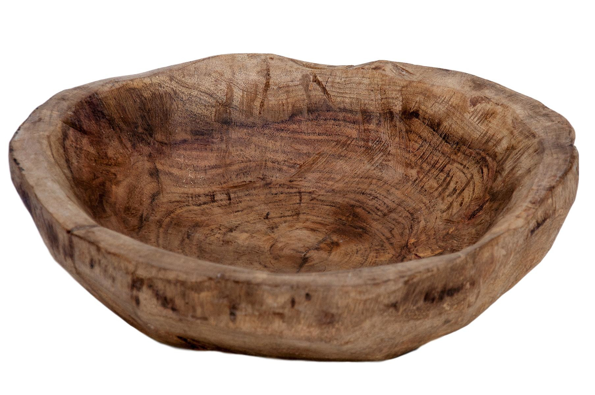

# Gamelas

- **G**rupos pequenos e sazonais de
- **A**juda mútua
- **M**ultiplicativos para
- **E**nriquecimento multidimensional
- **L**iberdade econômica e
- **A**ntifragilidade em rede

("Gamela" é tipo uma panelinha, só que aberta 🤪)
